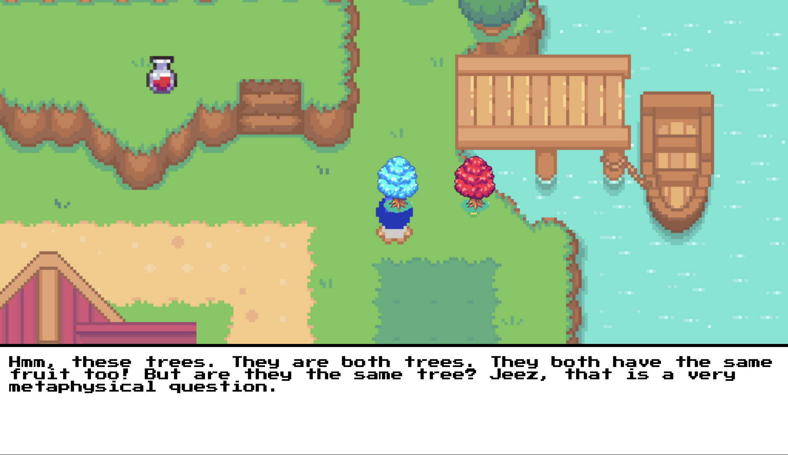

# Ojiisan: Grandfather Paradox

> Base template is borrowed from [here](https://chriscoursespokemon.netlify.app/) but all interactions and the story is different :)
## 🎮 The Game

Before proceeding, I would recommend you try out the game for yourself! Use  `w` `a` `s` `d` to move up, left, down and right respectively and click on dialogues to cyle through them. I am also attaching a link to demo of me playing the game incase you miss any of the interactions.

Game Link → [`https://ojiisan.vercel.app`](https://ojiisan.vercel.app/)

[Demo Video Link](https://drive.google.com/file/d/1AZyW0HuXZVC9zA1gKsuo0IN49P_VqruZ/view?usp=sharing)

## 📙 Story

You start the game stranded in time and space, in a familiar yet unknown location. The game story is partially based on the reading *Paradoxes of Time Travel*, which was originally based on the principle of The Grandfather Pardox. As described in the story of Tim, his situation (and yours in the game) is that fatal tricky. You are essentially in your personal timeline while having not been born. 

## 🎭 Related Reading + Concept

Your intentions my be different but the plot is based around the eventual confrontation with your grandfather (a sort of shootout for Tim and an actual *battle* for you), which is bound to end in failure for you. If you interfere with your personal past, you are inheirently creating a paradox and creating a branch /  alternate timeline where you (potentially) murder your own grandfather. Considering that you follow through with it, you essentially prevent your own birth. The death of your grandfather implies, your father was never born (in some cases), and it further implies he never married your mother → you were never born.

Now, if you were never born, this means you never got to use the time machine / whatever portal transported you to ever murder your grandfather in the first place. Further solidifying the logic that a time traveler cannot change the past. What is known cannot be false.

The only metaphysical explanation to it’s possibility is that every time you travel you go from one branch to another. In one Tim/You are absent from the past, Grandfather lives Tim/You are born and you grow up. The other
branch diverges from the first when Tim turns up in the past; there Tim kills Grandfather and Grandfather leaves
no descendants.

It is not a principle in which Tim/You change the
past. 1921 and later years contain the events of both branches, coexisting somehow without interaction. It remains true at all the personal times of Tim’s life, even after the killing, that Grandfather lives in one branch and dies in the other.

## 💻 Installing Locally

```bash

# Clone this repository.
git clone https://github.com/parzuko/ojiisan.git
cd ojiisan

# Run it locally
open index.html

```


Made for Metaphysics, Spring 2022 (And For Fun!) :v: [Say Hi!](https://twitter.com/parzuko)